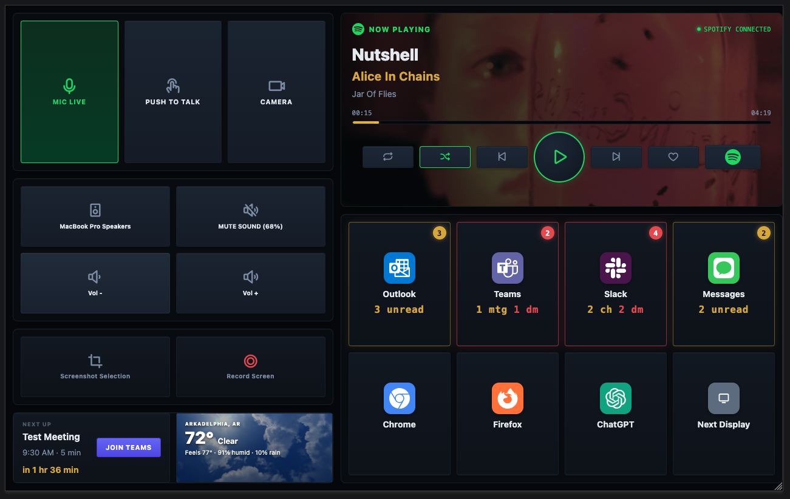

# GeekSpoons

A Hammerspoon-based workstation controller that turns any tablet or browser into a customizable Stream Deck for macOS. Control your mic, camera, audio devices, Spotify, screenshots, screen recordings, and app launching from a single web interface — plus live unread counts for Slack, Teams, Outlook, and Google Messages, a calendar "next up" widget, and weather.

## Features

- **Meeting Controls** — Mic mute toggle with HUD indicator, push-to-talk, camera toggle (auto-detects Zoom, Teams, Slack, Webex, Google Meet)
- **Audio Management** — Cycle output/input devices (auto-pairs AirPods/USB headsets), mute, volume up/down
- **Screen Capture** — Screenshot selection to clipboard, screen recording toolbar
- **Spotify** — Full playback control (play/pause, next/prev, shuffle, repeat, like), album artwork, progress bar, playlist chooser
- **Attention Indicators** — Live unread counts for Slack (channels + DMs), Teams (people + meetings + channels), Outlook (inbox unread), and Google Messages
- **Calendar** — "Next Up" widget with color-coded time remaining (red < 1hr, yellow 1-24hr, grey > 24hr) and one-tap meeting join
- **Weather** — Current conditions with Unsplash weather backgrounds
- **App Launcher** — One-tap launch/focus for Chrome, Messages, ChatGPT, Teams, Slack, Outlook, Firefox
- **Keyboard Hotkeys** — Hyper key (Cmd+Alt+Ctrl+Shift) bindings for mic, Spotify, window management

## Quick Start

1. Install [Hammerspoon](https://www.hammerspoon.org/)
2. Clone this repo into `~/.hammerspoon/`
3. Copy `.env.example` to `.env` and fill in your calendar URL and weather location
4. Install Node.js dependencies: `cd scripts && npm install`
5. Reload Hammerspoon (or press Cmd+Alt+Ctrl+Shift+R)
6. Open `http://<your-mac-ip>:8080` on your tablet or browser

## Documentation

Full setup, configuration, architecture, and troubleshooting guide: **[DOCS/GEEKSPOONS_MANUAL.md](DOCS/GEEKSPOONS_MANUAL.md)**

## License

This project is released into the public domain under the [Unlicense](LICENSE).
